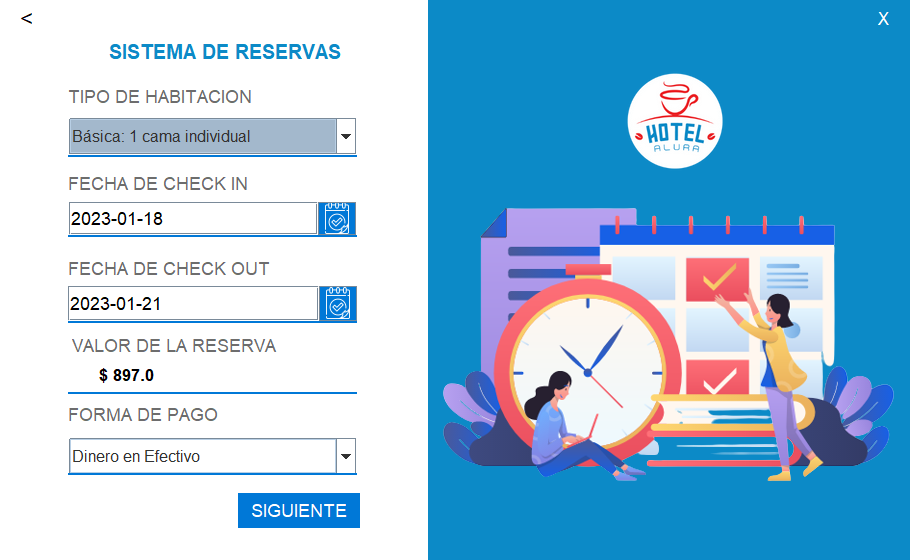
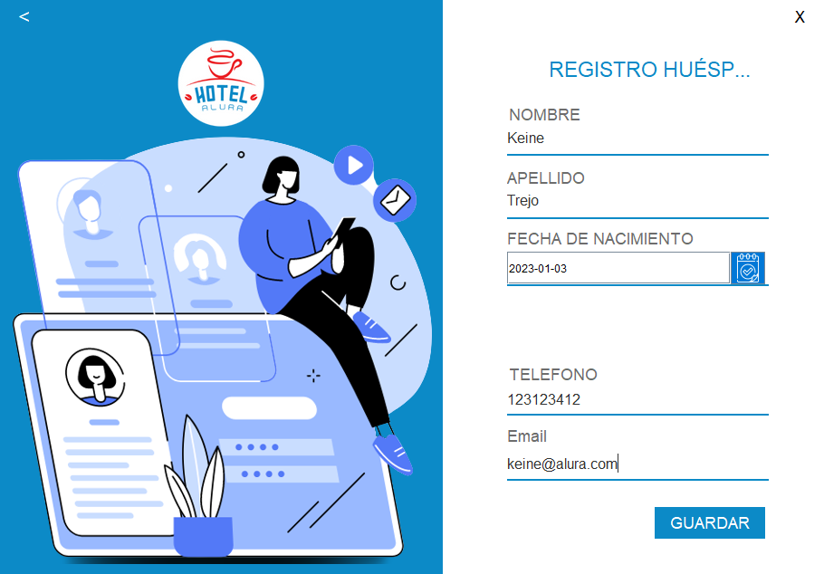
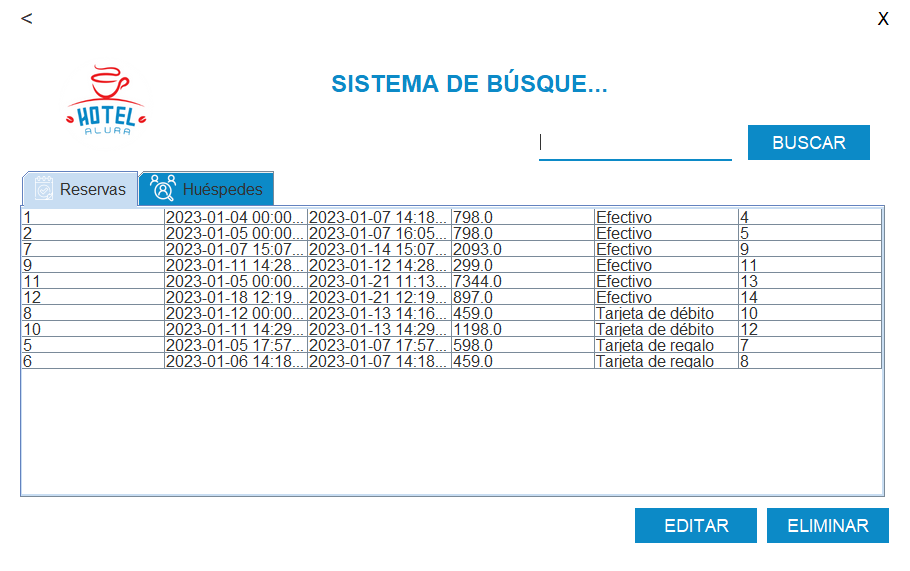
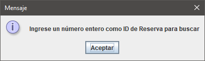
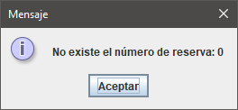
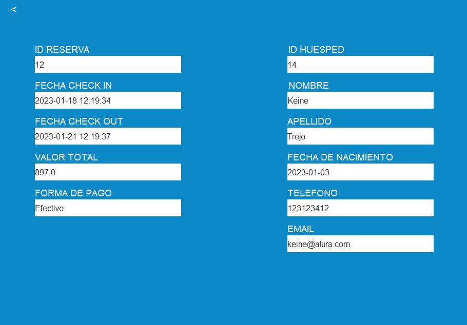

# Challenge ONE | Java | Back-end | Hotel Alura

     

---

## 🖥️ Tecnologías Utilizadas:

- Java 9
- Visual Studio Code
- Biblioteca JCalendar
- MySql  

---

Hotel Alura - Back End  

     Este proyecto se encargó de implementar las funcionalidades para el sistema de un Hotel a partir del repositorio de Alura:

     [Proyecto de Alura Latam](https://github.com/alura-challenges/challenge-one-alura-hotel-latam)

     Este contiene el aspecto visual desarrollado totalmente en Java y con esta base se añadieron las funciones a botones, tablas, consultas y registros hacia la base de datos.
     Para la base de datos se utilizó <strong>MySQL</strong> mediante JDBC, una API diseñada como controlador de conexiones a bases de datos. En el diagrama dentro de la carpeta <strong>sql<strong> se encuentra la base de datos normalizada. Aunque esta no se encuentra totalmente implementada dentro de las consultas y registros que se hacen desde la aplicación en Java.

[DB Normalizada](https://github.com/KeineTM/OracleNextEducation---Hotel-Java/blob/repositorio-base/sql/diagrama_E-R_normalizada1.png)

     Todos los métodos están escritos en Java, permitiendo validar contenido de los registros con la base de datos como es el caso del <strong>Login</strong> de la aplicación. Es posible ingresar con las credenciales: <strong>admin</strong> como usuario y contraseña por defecto como en el código original, aunque remarcando que se ejecutan consultas a la base de datos para ello.

     En el módulo de <strong>Registro de Reservas</strong> se despliegan los formularios para ingresar los datos para registrar una reserva y a su huesped correspondiente en un sólo método y conexión.
     
  
  

     En el módulo de <strong>Búsquedas</strong> se carga automáticamente una tabla con los registros de las tablas Reservas y Huespedes de la base de datos.

  

     Al seleccionar una fila de la tabla de Reservas es posible eliminar dicha fila mediante el botón <strong>Eliminar</strong>. Mientras que al modificar alguno de sus datos directamente se pueden ejecutar los cambios en la base de datos con el botón <strong>Editar</strong>. En el caso de que no se tenga seleccionada ninguna fila al pulsar el botón, se le informará al usuario.

     En el campo del botón <strong>Buscar</strong> se valida que el usuario ingrese un número entero, para lanzar la notificación si esto ocurre, así como validar que el número solicitado exista en la tabla.

  
  

     Finalmente, en caso de cumplir con todos los criterios anteriores se despliega una nueva ventana con la información del registro solicitada, incluyendo los datos del huesped:

  

